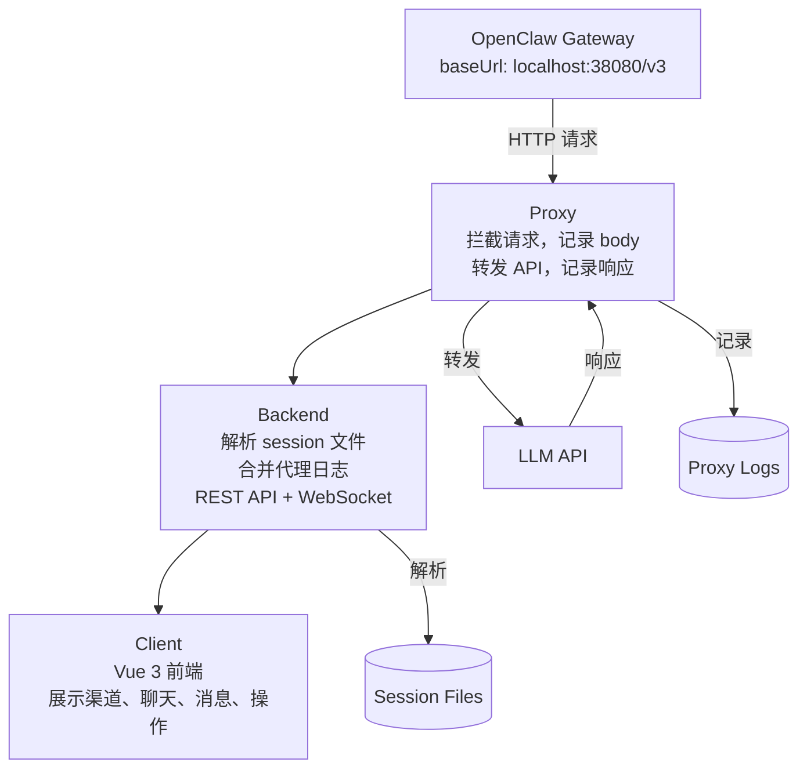
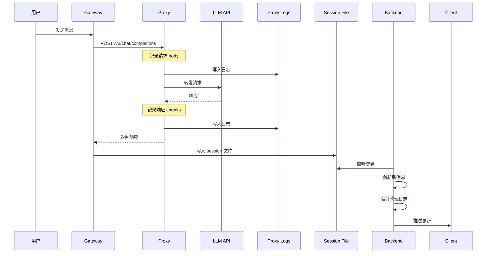
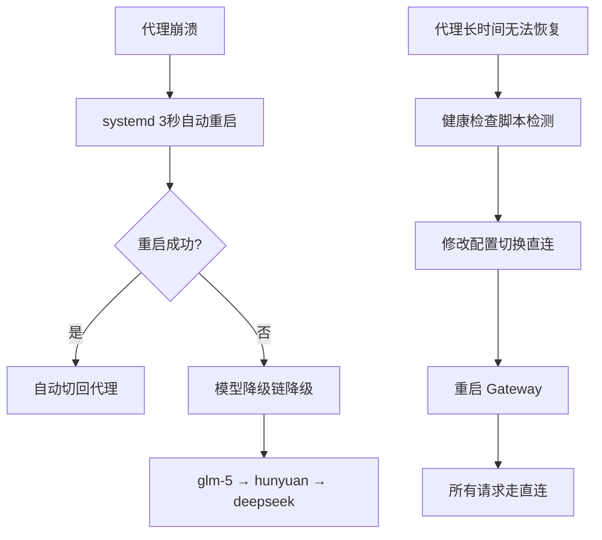

# OpenClaw Monitor - 开发指南

> 本文档帮助 AI 快速理解项目，进行优化迭代。

---

## 一、项目定位

**OpenClaw Monitor** 是一个 OpenClaw 监控工具，核心功能：

1. **解析 session 文件**：提取对话历史和操作记录
2. **拦截 LLM API 调用**：通过 HTTP 代理捕获完整的请求/响应
3. **实时监控**：通过 WebSocket 推送更新
4. **故障保障**：代理不可用时自动切换直连

---

## 二、核心架构



---

## 三、关键逻辑

### 3.1 Session 文件解析 (packages/backend/src/parser/index.ts)

**Session 文件格式**：

```jsonl
{"type":"session","id":"agent:mime-qq:qqbot:direct:xxx"}
{"type":"message","message":{"role":"user","content":"你好"}}
{"type":"message","message":{"role":"assistant","content":[...]}}
```

**解析流程**：

```typescript
function parseSessionFile(filePath: string) {
  const lines = fs.readFileSync(filePath).split('\n');
  const messages = [];
  
  for (const line of lines) {
    const msg = JSON.parse(line);
    if (msg.type === 'message') {
      messages.push({
        role: msg.message.role,
        content: msg.message.content,
        usage: msg.message.usage
      });
    }
  }
  
  return messages;
}
```

**关键点**：
- session 文件是 JSONL 格式（每行一个 JSON）
- `type: "session"` 是会话元信息
- `type: "message"` 是消息记录
- `message.content` 可能是字符串或数组

### 3.2 代理拦截 (packages/proxy/src/index.ts)

**核心流程**：

```typescript
// 1. 接收请求
server.on('request', (req, res) => {
  // 2. 收集请求体
  collectRequestBody(req);
  
  // 3. 转发到真实 API
  proxy.web(req, res, { target: TARGET_URL });
});

// 4. 拦截响应
res.on('end', () => {
  // 5. 解析流式响应 (SSE)
  if (isStreaming) {
    chunks = parseSSEData(resBody);
  }
  
  // 6. 写入日志
  writeLog({
    timestamp,
    request: { body: reqBody },
    response: { body: resBody },
    isStreaming
  });
});
```

**关键点**：
- 流式响应需要特殊处理（解析 SSE 格式）
- 日志按日期分文件（`llm-YYYY-MM-DD.jsonl`）
- 不修改请求内容，只记录

### 3.3 代理日志合并 (packages/backend/src/parser/proxy-log.ts)

**核心逻辑**：

```typescript
function enrichWithProxyLog(message) {
  if (message.role !== 'assistant') return message;
  
  // 根据时间戳匹配代理日志
  const proxyLog = findProxyLogByTimestamp(message.timestamp);
  
  if (proxyLog) {
    return {
      ...message,
      llmDetails: {
        requestPrompt: proxyLog.request.body.messages,
        responseContent: proxyLog.response.body,
        durationMs: proxyLog.durationMs
      }
    };
  }
  
  return message;
}
```

**关键点**：
- 通过时间戳匹配（容忍 5 秒误差）
- 只对 assistant 消息合并（用户消息没有 LLM 调用）
- 合并后前端可以展示完整的 prompt 和响应

### 3.4 健康检查脚本 (scripts/proxy-healthcheck.sh)

**核心逻辑**：

```bash
# 1. 检测代理
curl -s --max-time 5 http://localhost:38080/health

# 2. 根据结果切换配置
if proxy_available; then
  # 使用代理
  jq '.baseUrl = "http://localhost:38080/v3"' config.json
else
  # 切换直连
  jq '.baseUrl = "https://api.lkeap.cloud.tencent.com/coding/v3"' config.json
  systemctl restart openclaw-gateway
fi
```

**关键点**：
- 冷却期：切换后 5 分钟内不再切换
- 文件锁：防止并发执行
- 需要重启 Gateway 才能生效

---

## 四、关键决策

### 决策 1：为什么用 HTTP 代理而不是修改 pi-ai 源码？

**原因**：
1. pi-ai 是第三方库，修改源码难以维护
2. 升级 pi-ai 会丢失修改
3. HTTP 代理是标准方案，通用性强

**代价**：
- 需要修改 OpenClaw 配置（baseUrl）
- 需要额外的进程（代理服务）

### 决策 2：为什么不只用模型降级链？

**问题**：
- 代理挂了，每次请求都要等待超时（~10秒）
- 降级链会尝试多个模型，累积延迟可达 20+ 秒
- 用户体验差

**解决方案**：
- 健康检查脚本自动切换配置
- 一次性中断，之后所有请求都走直连

### 决策 3：为什么用 JSONL 格式存储日志？

**原因**：
1. **追加写入效率高**：不需要读取整个文件
2. **崩溃安全**：每行独立，不会因为崩溃损坏整个文件
3. **易于解析**：逐行读取即可

**替代方案**：
- SQLite：查询方便，但追加写入性能差
- 二进制格式：性能好，但不可读

### 决策 4：为什么不支持环境变量配置 baseUrl？

**原因**：
- pi-ai 源码中 baseUrl 从配置读取，不支持环境变量
- 修改 pi-ai 源码不可行（见决策 1）

**结论**：
- 必须修改配置文件
- 健康检查脚本可以自动修改

---

## 五、数据流

### 5.1 LLM 调用流程



### 5.2 故障处理流程



---

## 六、未来优化方向

### 6.1 性能优化

| 问题 | 方案 |
|------|------|
| 大 session 文件解析慢 | 流式解析，只解析新增行 |
| 代理日志匹配慢 | 建立时间索引 |
| 前端列表渲染慢 | 虚拟滚动 |

### 6.2 功能增强

| 功能 | 方案 |
|------|------|
| 多用户支持 | 添加认证层 |
| 历史数据查询 | 导入 SQLite |
| 告警通知 | 集成邮件/钉钉 |
| Token 用量统计 | 解析 usage 字段 |

### 6.3 可靠性增强

| 问题 | 方案 |
|------|------|
| 代理单点故障 | 主备代理切换 |
| 日志丢失 | 日志备份到云存储 |
| 配置损坏 | 配置版本管理 |

---

## 七、调试技巧

### 7.1 查看代理日志

```bash
# 实时查看
tail -f /var/log/openclaw-monitor/llm-$(date +%Y-%m-%d).jsonl

# 搜索特定请求
grep "sessionKey" /var/log/openclaw-monitor/llm-*.jsonl
```

### 7.2 测试代理

```bash
# 健康检查
curl http://localhost:38080/health

# 发送测试请求
curl -X POST http://localhost:38080/v3/chat/completions \
  -H "Content-Type: application/json" \
  -d '{"model":"glm-5","messages":[{"role":"user","content":"hi"}]}'
```

### 7.3 查看 session 文件

```bash
# 列出所有 session 文件
find /root/.openclaw/agents -name "*.jsonl"

# 查看最新消息
tail -1 /root/.openclaw/agents/mime-qq/sessions/*.jsonl | jq .
```

---

## 八、常见问题

### Q1: 代理启动失败

**检查**：
```bash
systemctl status openclaw-proxy
journalctl -u openclaw-proxy -n 50
```

**常见原因**：
- 端口被占用：`lsof -i :38080`
- Node.js 版本不对：`node -v`（需要 >= 18）

### Q2: 日志没有记录

**检查**：
```bash
ls -la /var/log/openclaw-monitor/
```

**常见原因**：
- 目录不存在：`mkdir -p /var/log/openclaw-monitor`
- 权限问题：`chmod 755 /var/log/openclaw-monitor`

### Q3: 前端无法连接后端

**检查**：
```bash
curl http://localhost:3000/api/channels
```

**常见原因**：
- 后端未启动：`pnpm dev:backend`
- 跨域问题：检查 CORS 配置

---

## 九、代码导航

```
packages/proxy/src/index.ts       # 代理核心逻辑
packages/backend/src/parser/      # session 解析
packages/backend/src/routes/      # REST API
packages/backend/src/watcher/     # 文件监听
packages/client/src/components/   # Vue 组件
scripts/install.sh                # 一键安装
scripts/proxy-healthcheck.sh      # 健康检查
```

---

*最后更新：2026-03-16*
*维护者：OpenClaw Monitor Team*
