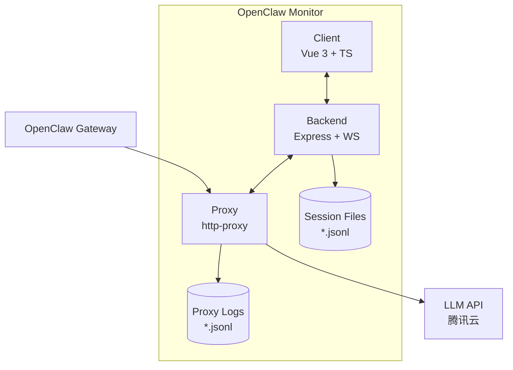
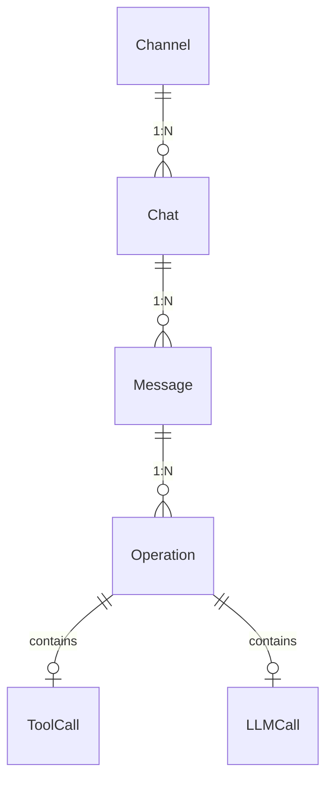
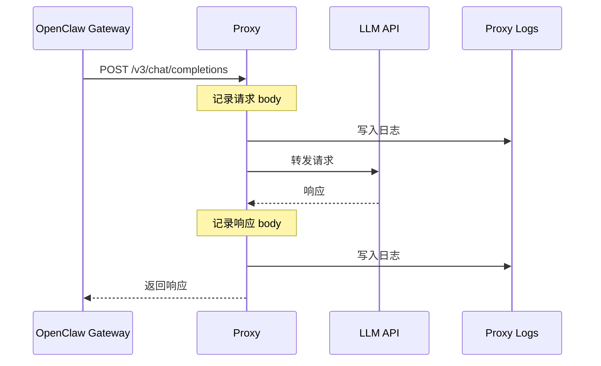
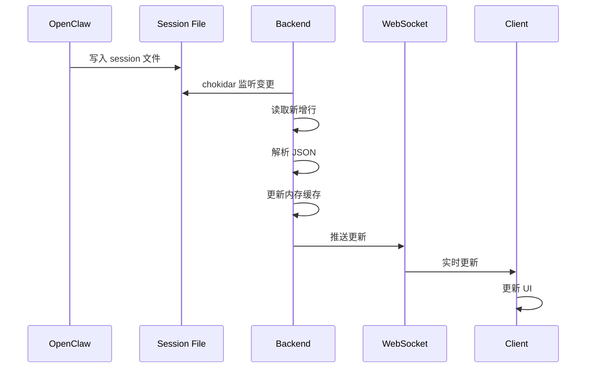
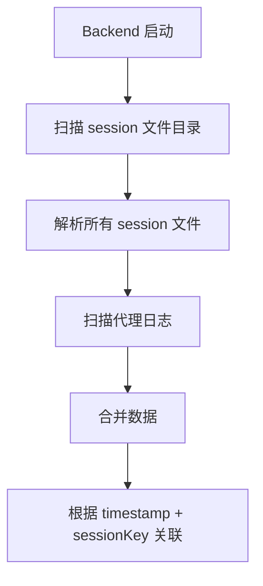
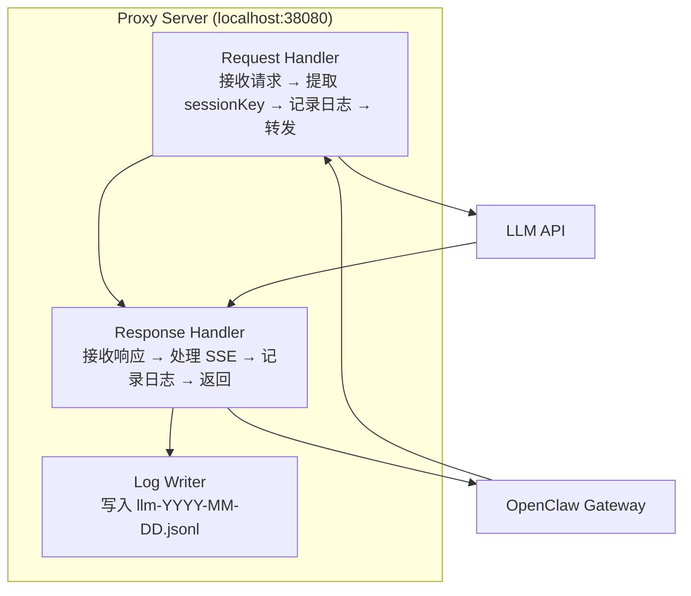
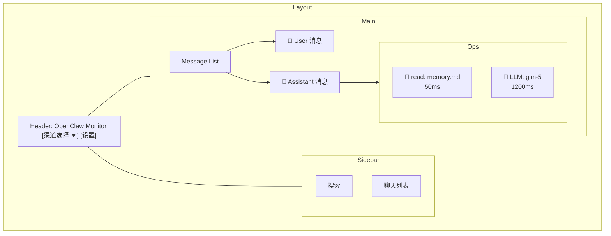

# OpenClaw Monitor - 架构设计

> 创建时间：2026-03-15
> 版本：v1.0

---

## 一、系统架构

### 1.1 整体架构图



### 1.2 组件职责

| 组件 | 职责 | 技术 |
|------|------|------|
| **Proxy** | 拦截 LLM 请求/响应，记录完整数据 | Node.js + http-proxy |
| **Backend** | 解析 session 文件，提供 API，实时推送 | Node.js + Express + WebSocket |
| **Client** | 用户界面，本地缓存，数据展示 | Tauri + Vue 3 + SQLite |

---

## 二、数据模型

### 2.1 实体关系图



### 2.2 数据结构

#### Channel（渠道）

```typescript
interface Channel {
  id: string;           // 渠道标识，如 "qqbot"
  name: string;         // 显示名称，如 "QQ Bot"
  type: string;         // 类型：qqbot, discord, telegram
  status: 'online' | 'offline';
  config?: any;         // 原始配置
}
```

#### Chat（聊天）

```typescript
interface Chat {
  id: string;           // 聊天 ID
  channelId: string;    // 所属渠道
  sessionKey: string;   // OpenClaw session key
  title: string;        // 聊天标题（用户名/群名）
  lastMessageAt: number; // 最后消息时间戳
  messageCount: number; // 消息数量
  sessionFile: string;  // session 文件路径
}
```

#### Message（消息）

```typescript
interface Message {
  id: string;           // 消息 ID
  chatId: string;       // 所属聊天
  role: 'user' | 'assistant' | 'toolResult';
  content: Content[];   // 消息内容
  timestamp: number;    // 时间戳
  operations?: Operation[]; // 关联的操作
  usage?: Usage;        // Token 使用量（assistant 消息）
}

interface Content {
  type: 'text' | 'thinking' | 'toolCall' | 'image';
  text?: string;
  thinking?: string;
  toolCall?: ToolCall;
  image?: { url: string };
}

interface Usage {
  input: number;
  output: number;
  cacheRead: number;
  cacheWrite: number;
  totalTokens: number;
}
```

#### Operation（操作）

```typescript
interface Operation {
  id: string;           // 操作 ID
  messageId: string;    // 所属消息
  type: 'tool' | 'llm'; // 操作类型
  name: string;         // 操作名称（read/exec/llm-call）
  input: any;           // 输入参数
  output: any;          // 输出结果
  status: 'pending' | 'running' | 'completed' | 'failed';
  error?: string;       // 错误信息
  startedAt: number;    // 开始时间
  completedAt: number;  // 完成时间
  durationMs: number;   // 耗时（毫秒）
}
```

#### LLMCall（LLM 调用详情）

```typescript
interface LLMCall {
  id: string;
  messageId: string;
  provider: string;     // 提供商：tencentcodingplan
  model: string;        // 模型：glm-5
  
  // 来自代理拦截
  requestPrompt?: any[];  // 完整的 messages 数组
  responseContent?: any;  // 完整的响应内容
  
  // 来自 session 文件
  usage: Usage;
  
  startedAt: number;
  completedAt: number;
  durationMs: number;
}
```

---

## 三、数据流设计

### 3.1 LLM 调用流程



### 3.2 Session 文件更新流程



### 3.3 数据合并流程



---

## 四、API 设计

### 4.1 REST API

#### 获取渠道列表

```
GET /api/channels

Response:
{
  "channels": [
    {
      "id": "qqbot",
      "name": "QQ Bot",
      "type": "qqbot",
      "status": "online"
    }
  ]
}
```

#### 获取聊天列表

```
GET /api/chats?channel=qqbot&limit=50&offset=0

Response:
{
  "chats": [
    {
      "id": "xxx",
      "channelId": "qqbot",
      "title": "用户A",
      "lastMessageAt": 1773587482000,
      "messageCount": 5
    }
  ],
  "total": 10
}
```

#### 获取消息列表

```
GET /api/messages?chat=xxx&limit=100

Response:
{
  "messages": [
    {
      "id": "msg-1",
      "role": "user",
      "content": [{"type": "text", "text": "你好"}],
      "timestamp": 1773587482000
    },
    {
      "id": "msg-2",
      "role": "assistant",
      "content": [...],
      "timestamp": 1773587483000,
      "operations": [...],
      "usage": {"input": 100, "output": 50}
    }
  ]
}
```

#### 获取操作详情

```
GET /api/operations?message=msg-2

Response:
{
  "operations": [
    {
      "id": "op-1",
      "type": "tool",
      "name": "read",
      "input": {"file_path": "/root/memory.md"},
      "output": "文件内容...",
      "durationMs": 50
    },
    {
      "id": "op-2",
      "type": "llm",
      "name": "glm-5",
      "requestPrompt": [...],  // 来自代理
      "responseContent": {...}, // 来自代理
      "usage": {"input": 100, "output": 50},
      "durationMs": 1200
    }
  ]
}
```

### 4.2 WebSocket 事件

```typescript
// 连接
ws://localhost:3000/ws

// 事件格式
{
  "event": "session:update",
  "data": {
    "chatId": "xxx",
    "message": {...}
  }
}

// 事件类型
- session:update    // session 文件更新
- llm:request       // LLM 请求拦截
- llm:response      // LLM 响应拦截
- operation:start   // 操作开始
- operation:end     // 操作结束
```

---

## 五、代理设计

### 5.1 代理架构



### 5.2 日志格式

```json
{
  "timestamp": 1773587482000,
  "sessionId": "7add3c20-e176-460b-9eac-a1a7dc1d808b",
  "sessionKey": "agent:mime-qq:qqbot:direct:xxx",
  "request": {
    "method": "POST",
    "path": "/v3/chat/completions",
    "headers": {...},
    "body": {
      "model": "glm-5",
      "messages": [...],
      "stream": true
    }
  },
  "response": {
    "status": 200,
    "headers": {...},
    "body": {...}  // 或流式 chunks
  },
  "durationMs": 1200
}
```

---

## 六、前端设计

### 6.1 页面结构



### 6.2 组件结构

```
src/
├── components/
│   ├── Layout/
│   │   ├── Header.vue
│   │   ├── Sidebar.vue
│   │   └── MainContent.vue
│   ├── Chat/
│   │   ├── ChatList.vue
│   │   └── ChatItem.vue
│   ├── Message/
│   │   ├── MessageList.vue
│   │   ├── MessageItem.vue
│   │   └── MessageContent.vue
│   └── Operation/
│       ├── OperationList.vue
│       ├── OperationItem.vue
│       ├── ToolOperation.vue
│       └── LLMOperation.vue
├── views/
│   ├── Home.vue
│   └── Settings.vue
├── stores/
│   ├── channels.ts
│   ├── chats.ts
│   └── messages.ts
├── services/
│   ├── api.ts
│   └── websocket.ts
└── utils/
    └── format.ts
```

---

## 七、部署架构

### 7.1 开发环境

```
localhost:
├── 38080  → Proxy
├── 3000   → Backend
└── 1420   → Client (Tauri dev)
```

### 7.2 生产环境

```
服务器 (OpenClaw 所在机器):
├── Proxy (systemd 服务)
│   └── 监听 38080
├── Backend (systemd 服务)
│   ├── 监听 3000
│   └── WebSocket
└── 日志目录
    ├── /var/log/openclaw-monitor/
    └── /root/.openclaw/agents/*/sessions/

本地机器:
└── Client (桌面应用)
    ├── 连接服务器 Backend
    └── 本地 SQLite 缓存
```

---

## 八、性能考虑

### 8.1 后端优化

| 优化点 | 方案 |
|--------|------|
| 文件解析 | 流式读取，避免全量加载 |
| 内存占用 | LRU 缓存，限制最近 N 个聊天 |
| 实时推送 | WebSocket，避免轮询 |

### 8.2 前端优化

| 优化点 | 方案 |
|--------|------|
| 列表渲染 | 虚拟滚动，只渲染可见项 |
| 数据缓存 | SQLite 本地存储 |
| 增量更新 | 只同步变更数据 |

---

## 九、安全考虑

| 风险 | 对策 |
|------|------|
| API Key 泄露 | 代理日志脱敏敏感字段 |
| 本地数据泄露 | SQLite 可选加密 |
| 未授权访问 | Backend 可选 Token 认证 |

---

*最后更新：2026-03-15 23:20*
