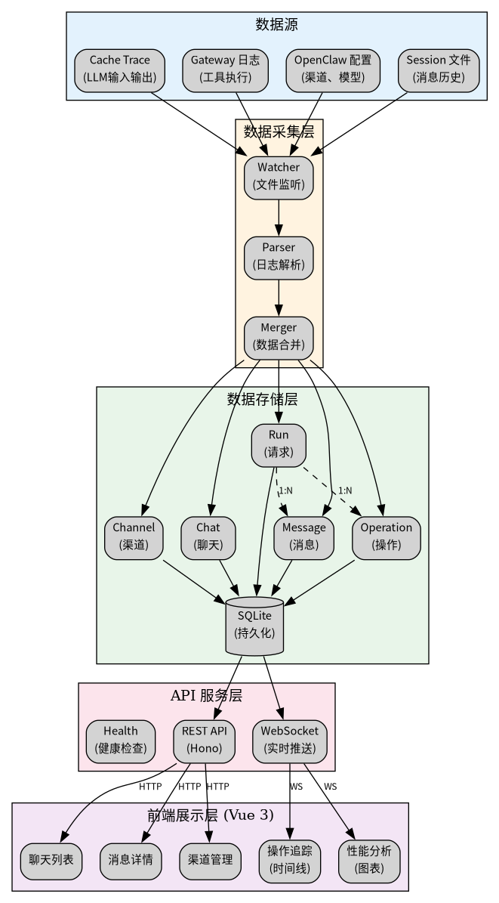
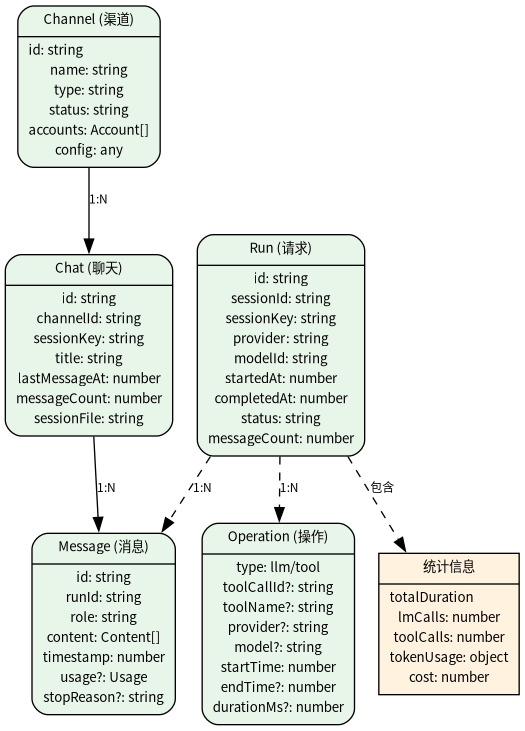
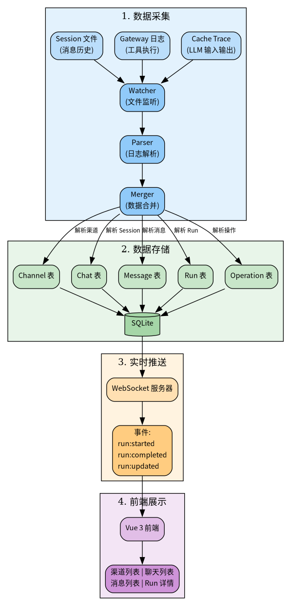

# OpenClaw Monitor 架构设计

> 最后更新：2026-03-18

---

## 一、系统架构



---

## 二、数据模型



### 字段说明

| 模型 | 关键字段 | 说明 |
|------|----------|------|
| **Channel** | id, name, type, status | 渠道信息，从 `openclaw.json` 解析 |
| **Chat** | id, channelId, sessionKey, title | 聊天信息，从 session 文件解析 |
| **Message** | id, runId, role, content, timestamp | 消息内容，从 session 文件解析 |
| **Run** | id, sessionId, provider, modelId, status | 请求信息，从 Cache Trace 解析 |
| **Operation** | type, toolName, durationMs | 操作信息，从 Gateway 日志解析 |

---

## 三、数据源

### 3.1 Cache Trace

**位置**：`~/.openclaw/logs/cache-trace.jsonl`

**配置要求**：

```json
{
  "diagnostics": {
    "enabled": true,
    "cacheTrace": {
      "enabled": true,
      "includeMessages": true,
      "includePrompt": false,
      "includeSystem": false
    }
  }
}
```

> **注意**：关闭 `includePrompt` 和 `includeSystem` 可减少 90% 文件大小。

**Stage 类型**：

| Stage | 说明 | 包含信息 |
|-------|------|----------|
| `stream:context` | LLM 输入 | **messages[], provider, modelId** |
| `session:after` | LLM 输出 | **messages[], usage, cost** |

### 3.2 Gateway 日志

**位置**：`/tmp/openclaw/openclaw-*.log`

**需要配置 DEBUG 级别**：

```json
{
  "logging": {
    "level": "debug"
  }
}
```

**包含信息**：

| 日志类型 | 示例 | 说明 |
|---------|------|------|
| 工具执行 | `embedded run tool start/end: tool=exec` | 工具名称、耗时 |
| LLM 调用 | `embedded run start/prompt end` | provider, model, 耗时 |
| 上下文诊断 | `[context-diag] messages=73` | 上下文大小 |

### 3.3 OpenClaw 配置

**位置**：`~/.openclaw/openclaw.json`

**包含信息**：渠道配置、模型配置、诊断配置

### 3.4 Session 文件

**位置**：
- `~/.openclaw/sessions/*.jsonl` - 全局 Session
- `~/.openclaw/qqbot/sessions/*.json` - QQ Bot Session

---

## 四、数据流



### 流程说明

1. **数据采集**：Watcher 监听文件变更 → Parser 解析日志 → Merger 合并数据
2. **数据存储**：解析结果聚合后存入 SQLite（仅 runs 表）
3. **实时推送**：WebSocket 推送 run:started/completed/updated 事件
4. **前端展示**：Vue 3 前端实时更新渠道、聊天、消息、Run 详情

---

## 五、API 接口

### 5.1 渠道管理

| 接口 | 方法 | 说明 |
|------|------|------|
| `/api/channels` | GET | 获取渠道列表 |
| `/api/channels/:channelId` | GET | 获取渠道详情 |
| `/api/channels/refresh` | POST | 刷新渠道信息 |

### 5.2 聊天管理

| 接口 | 方法 | 说明 |
|------|------|------|
| `/api/chats` | GET | 获取聊天列表（支持 channelId 过滤） |
| `/api/chats/:chatId` | GET | 获取聊天详情 |
| `/api/chats/:chatId/messages` | GET | 获取聊天消息 |

### 5.3 Run 管理

| 接口 | 方法 | 说明 |
|------|------|------|
| `/api/runs` | GET | 获取 Run 列表（支持分页、排序） |
| `/api/runs/:runId` | GET | 获取 Run 详情 |
| `/api/runs/:runId/operations` | GET | 获取 Run 操作列表 |

### 5.4 系统接口

| 接口 | 方法 | 说明 |
|------|------|------|
| `/health` | GET | 健康检查 |
| `/api/stats` | GET | 统计信息 |

---

## 六、数据库设计

### 设计原则

- **不存储原始数据**：仅保留聚合后的 runs 表，避免数据膨胀
- **定期清理**：通过 cron 任务定期清理过期数据

### 核心表

```sql
-- Run 聚合数据（唯一数据源）
CREATE TABLE runs (
  id INTEGER PRIMARY KEY AUTOINCREMENT,
  run_id TEXT UNIQUE NOT NULL,
  session_id TEXT NOT NULL,
  session_key TEXT NOT NULL,
  provider TEXT NOT NULL,
  model_id TEXT NOT NULL,
  workspace_dir TEXT,
  started_at INTEGER NOT NULL,
  completed_at INTEGER,
  status TEXT NOT NULL,
  input_messages TEXT,
  output_messages TEXT,
  message_count INTEGER DEFAULT 0,
  stages TEXT,
  error TEXT,
  created_at INTEGER NOT NULL,
  updated_at INTEGER NOT NULL,
  INDEX idx_session_id (session_id),
  INDEX idx_started_at (started_at)
);

-- WebSocket 消息（用于重连恢复）
CREATE TABLE ws_messages (
  id INTEGER PRIMARY KEY AUTOINCREMENT,
  seq INTEGER UNIQUE NOT NULL,
  type TEXT NOT NULL,
  data TEXT NOT NULL,
  created_at INTEGER NOT NULL,
  acked_at INTEGER,
  INDEX idx_seq (seq)
);

-- 文件位置记录（增量解析）
CREATE TABLE file_positions (
  id INTEGER PRIMARY KEY AUTOINCREMENT,
  file_path TEXT UNIQUE NOT NULL,
  position INTEGER NOT NULL,
  updated_at INTEGER NOT NULL
);
```

---

## 七、数据清理策略

### 7.1 Cache Trace 文件清理

**脚本**：`/etc/cron.daily/openclaw-cache-trace-cleanup`

| 配置项 | 值 |
|--------|---|
| 保留时间 | 12 小时 |
| 轮转阈值 | 500 MB |

### 7.2 数据库清理

**脚本**：`/etc/cron.daily/openclaw-monitor-db-cleanup`

| 表 | 清理策略 |
|---|---------|
| runs | 保留 30 天 |
| ws_messages | 保留最近 1000 条已确认消息 |
| VACUUM | 每次清理后执行 |

---

## 八、容错设计

| 场景 | 处理方式 |
|------|----------|
| 文件监听失败 | 重试 3 次，降级为定时轮询（5秒） |
| 解析失败 | 记录错误日志，跳过错误行继续解析 |
| WebSocket 断开 | 客户端自动重连，重发未确认消息 |
| SQLite 写入失败 | 内存缓存，定时重试 |

---

## 九、性能优化

| 优化点 | 方案 |
|--------|------|
| 文件解析 | 增量解析，只解析新增部分 |
| 数据库查询 | 索引优化（run_id, session_id, started_at） |
| 数据存储 | 仅存储聚合数据，不存储原始 cache_traces |
| WebSocket 推送 | 批量推送，节流控制 |

---

## 十、安全设计

| 安全点 | 方案 |
|--------|------|
| 文件路径验证 | 禁止路径穿越（`..`） |
| SQL 注入防护 | 参数化查询 |
| WebSocket 安全 | 仅本地连接 / Token 认证 |
| API 安全 | 速率限制、CORS 配置 |

---

## 十一、技术栈

| 组件 | 技术 |
|------|------|
| 后端框架 | Hono |
| 前端框架 | Vue 3 + TypeScript |
| 数据库 | SQLite (better-sqlite3) |
| 文件监听 | chokidar |
| WebSocket | 原生 WebSocket |
| 构建工具 | Vite |

---

*最后更新：2026-03-18*
